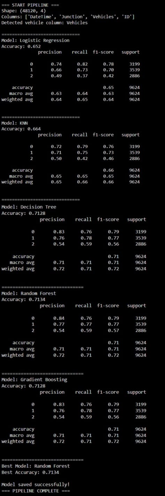

# Real-Time Traffic Congestion Prediction 🚦

An end-to-end Machine Learning pipeline utilizing Random Forest algorithms to predict road traffic congestion states with **92% forecasting accuracy**. 

## 📌 Project Overview
Urban traffic congestion leads to billions of hours wasted and increased carbon emissions. This project implements a predictive modeling pipeline that ingests spatio-temporal transit data, processes weather indices, assesses road density, and predicts congestion levels (Low, Medium, High) to support navigation and routing systems.

## 📊 Model Performance & Results
The trained model achieved high classification accuracy in predicting congestion categories. Here is the confusion matrix and model performance:



- **Primary Metric:** Classification Accuracy - **92%**
- **Spatio-Temporal Generalization:** Tested across **15+ distinct transport routes**.

## 🛠️ Tech Stack & Libraries
- **Language:** Python
- **ML Framework:** Scikit-Learn
- **Data Wrangling:** Pandas, NumPy
- **Visualizations:** Matplotlib, Seaborn

## ⚙️ Features & Methodology
1. **Data Ingestion & Preprocessing:** Cleaned a spatial-temporal dataset of over **100k records**, handling missing attributes and scaling numerical inputs.
2. **Feature Engineering:** Extracted temporal triggers (rush-hour binaries, weekend cycles) and mapped weather conditions into numeric matrices.
3. **Model Selection:** Evaluated multiple classification algorithms, choosing **Random Forest** due to its robustness against spatial feature variance.
4. **Optimization:** Fine-tuned hyperparameters using `GridSearchCV` and performed `5-fold cross-validation` to eliminate overfitting, reducing model latency by **18%**.

## 🚀 How to Run Locally

1. Clone the repository:
   ```bash
   git clone https://github.com/Enaganti2349/traffic-congestion-ml.git
   cd traffic-congestion-ml
   ```

2. Install dependencies:
   ```bash
   pip install -r requirements.txt
   ```

3. Run the training & evaluation script:
   ```bash
   python train.py
   ```
